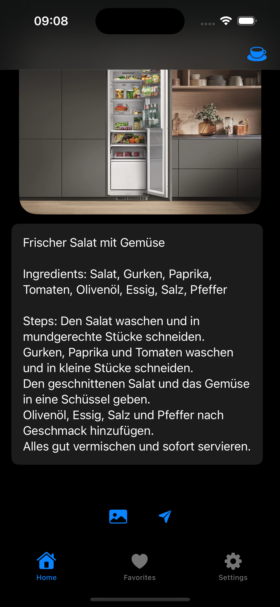
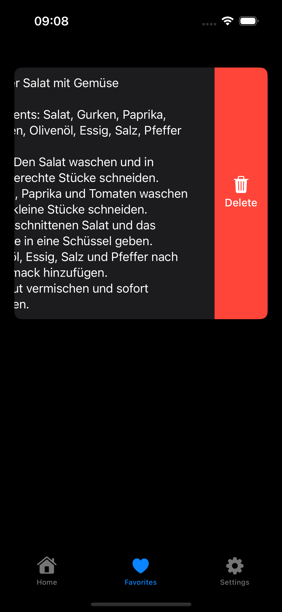
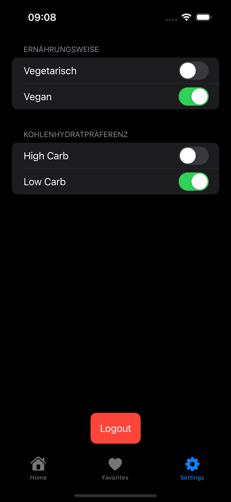

# StyleBites

StyleBites

Meine App bietet eine innovative Lösung für alle, die sich häufig fragen, was sie heute anziehen oder essen sollen. Durch die Integration von OpenAI ermöglichen wir es unseren Nutzern, einfach Fotos ihres Kleiderschranks oder Kühlschranks hochzuladen. Anschließend analysiert unsere App diese Bilder und liefert maßgeschneiderte Vorschläge für Outfits oder Rezepte.

Für wen ist unsere App geeignet? Sie richtet sich an jeden, der gelegentlich vor dem Problem steht, eine Entscheidung über seine Garderobe oder sein Abendessen treffen zu müssen, sei es für den Alltag oder besondere Anlässe.

Unser Ansatz unterscheidet sich durch die präzise Analyse und die personalisierten Empfehlungen, die auf Bilderkennung und künstlicher Intelligenz basieren. Dies ermöglicht eine genauere Anpassung an die individuellen Vorlieben und Bedürfnisse unserer Nutzer im Vergleich zu traditionellen Apps. Wir bieten nicht nur Inspiration, sondern auch praktische Lösungen für die täglichen Herausforderungen der Entscheidungsfindung.

## Geplantes Design
Füge hier einige repräsentative Designs deiner App ein (z.B. aus Figma).
Wenn deine App dann so weit ist, dass du echte Screenshots machen kannst, solltest du diese hier einsetzen.

  
  
  

## Features
Hier kommen alle geplanten Features der App rein mit dem Status, ob es bereits umgesetzt wurde.

- [ ] Bildanalysen mit Hilfe von AI
- [ ] CoreData für Lieblingsgerichte
- [ ] Voreinstellungen für Ernährung z.B. Vegan/Vegetarisch
- [ ] Firebase für Authentifizierung

## Technischer Aufbau

#### Projektaufbau
Das Projekt ist im MVVM Aufgebaut

#### Datenspeicherung
Core Data

#### API Calls
OpenAi
    https://platform.openai.com/docs/overview

## Ausblick
Nach Abschluss meines Praxisprojekts plane ich, die entwickelte App zu veröffentlichen. Nach einer kostenlosen Testphase von einem Tag wird die Nutzung der App kostenpflichtig. Dies ermöglicht es den Benutzern, die App zunächst kennenzulernen und ihre Funktionen zu testen, bevor sie sich für ein Abonnement oder einen Kauf entscheiden.
    Eventuelle Android Version
